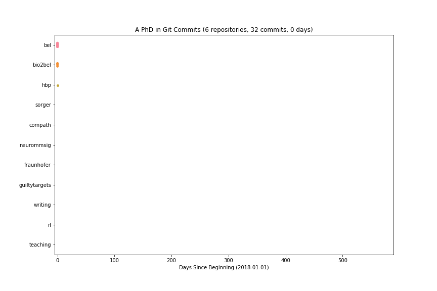

# Generation and Applications of Knowledge Graphs in Systems and Networks Biology [](https://zenodo.org/badge/latestdoi/185400874)

This repository contains the doctoral thesis of Charles Tapley Hoyt. Click [here](https://github.com/cthoyt/doctoral-thesis/raw/master/main.pdf) to get the PDF of the latest build from GitHub.

## Build

To build as a PDF, clone the repository and use the following command:

```bash
$ latexmk -pdf -pvc main
```

## Abstract

The acceleration in the generation of data in the biomedical domain has necessitated the use of computational approaches to assist in its interpretation.
However, these approaches rely on the availability of high quality, structured, formalized biomedical knowledge.

This thesis has the two goals to improve methods for curation and semantic data integration to generate high granularity biological knowledge graphs and to develop novel methods for using prior biological knowledge to propose new biological hypotheses.

The first two publications describe an ecosystem for handling biological knowledge graphs encoded in the Biological Expression Language throughout the stages of curation, visualization, and analysis.
Further, the second two publications describe the reproducible acquisition and integration of high-granularity knowledge with low contextual specificity from structured biological data sources on a massive scale and support the semi-automated curation of new content at high speed and precision.

After building the ecosystem and acquiring content, the last three publications in this thesis demonstrate three different applications of biological knowledge graphs in modeling and simulation.
The first demonstrates the use of agent-based modeling for simulation of neurodegenerative disease biomarker trajectories using biological knowledge graphs as priors.
The second applies network representation learning to prioritize nodes in biological knowledge graphs based on corresponding experimental measurements to identify novel targets.
Finally, the third uses biological knowledge graphs and develops algorithmics to deconvolute the mechanism of action of drugs, that could also serve to identify drug repositioning candidates.

Ultimately, the this thesis lays the groundwork for production-level applications of drug repositioning algorithms and other knowledge-driven approaches to analyzing biomedical experiments.

## Publications

1. Hoyt, C. T., Konotopez, A., & Ebeling, C. (2017). [PyBEL: a computational framework for Biological Expression Language](https://doi.org/10.1093/bioinformatics/btx660). *Bioinformatics (Oxford, England)*, 34(4), 703–704.
2. Hoyt, C. T., Domingo-Fernández, D., & Hofmann-Apitius, M. (2018). [BEL Commons: an environment for exploration and analysis of networks encoded in Biological Expression Language](https://doi.org/10.1093/database/bay126). *Database*, 2018(3), 1–11.
3. Hoyt, C. T., *et al.* (2019). [Re-curation and rational enrichment of knowledge graphs in Biological Expression Language](https://doi.org/10.1093/database/baz068). *Database*, 2019, baz068.
4. Hoyt, C. T., *et al.* (2019). [Bio2BEL: Integration of Structured Knowledge Sources with Biological Expression Language](https://doi.org/10.1101/631812). *submitted*.
5. Gündel, M., Hoyt, C. T., & Hofmann-Apitius, M. (2018). [BEL2ABM: Agent- based simulation of static models in Biological Expression Language](https://doi.org/10.1093/bioinformatics/bty107). *Bioinformatics*, 34(13), 2316–2318.
6. Muslu, Ö., Hoyt, C. T., Hofmann-Apitius, M., & Fröhlich, H. (2019). [GuiltyTargets: Prioritization of Novel Therapeutic Targets with Deep Network Representation Learning](https://doi.org/10.1101/521161). *IEEE/ACM Trans. Comput. Biol. Bioinform., submitted*.
7. Hoyt, C. T., *et al.* (2018). [A systematic approach for identifying shared mechanisms in epilepsy and its comorbidities](https://doi.org/10.1093/database/bay050). *Database*, 2018(1).

## Commits


